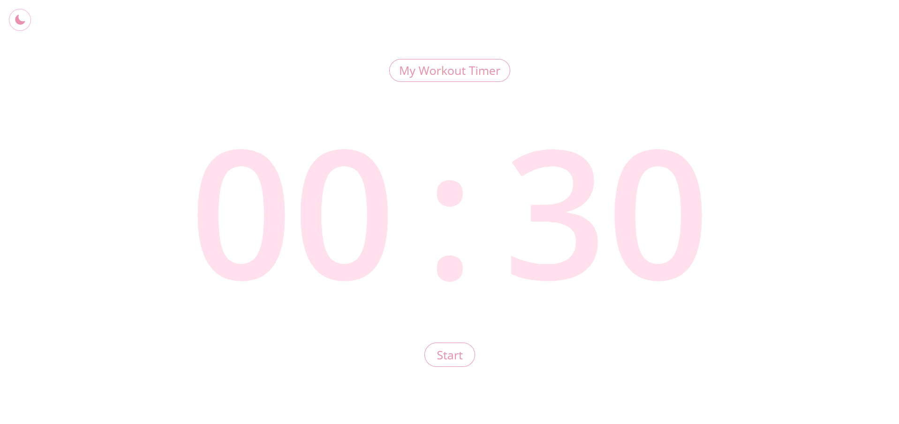
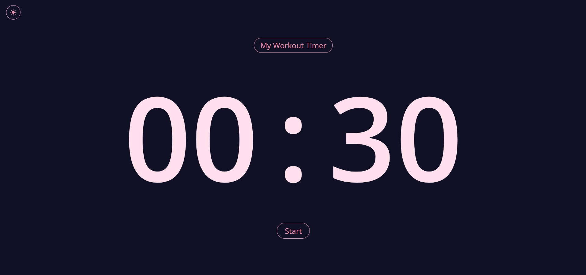

# My Workout Timer

A simple, beautiful, and responsive workout timer built with **React + Vite + Tailwind CSS**.

Designed to help you stay on track during your fitness routine, with features like a stylish countdown, dark mode, sound effects, and an intuitive interface — all packed into one lightweight app.

---

## 🔗 Live Demo
 [myworkout-timer.netlify.app](https://myworkout-timer.netlify.app/)

---

## ✨ Features

- Custom countdown timer with animated 3-2-1 intro
- Light/Dark mode toggle
- Sound alerts on start and end
- Fully responsive for mobile and desktop
- Sleek UI built with TailwindCSS
- Fast performance via Vite

---

## 📸 Screenshots

| Light Mode                             | Dark Mode                             |
|----------------------------------------|----------------------------------------|
|       |         |


---

## Tech Stack

- **React**
- **Vite**
- **Tailwind CSS**
- **Netlify**

---

## Getting Started


```bash
git clone https://github.com/danahparis21/my-workout-timer.git
cd my-workout-timer
npm install
npm run dev
```
---

## Author

Made with love by Danah Paris
